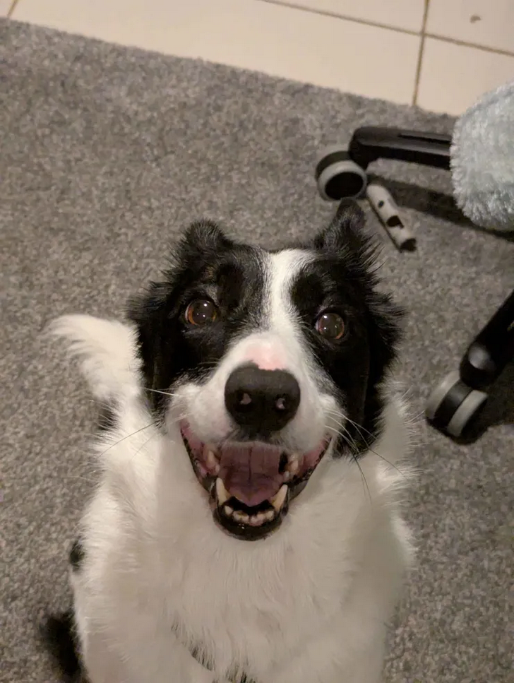

### 🖥️ `~/kohan_mathers $`

> *"Asking the useless questions since 2007"*

Want to navigate my profile easier? Use the interactive dialogue game below!

> Hi there, I'm Kohan! What would you like to explore?

*"I would like to explore..."*

...some more info about you

> Sure! What would you like to know about me?

*"I would like to find out..."*

  ...what to call you

> Of course! My name is Kohan Mathers so most people call me Kohan. If you know me online as IEatSystemFiles I get called system a lot, and sometimes files.

  ...your pronouns

> Sure! My preferred pronouns are they/them, but I don't mind people using feminine pronouns on me. I ask you don't use masculine pronouns on me unless this is our first time talking :)

  ...where you're based

> I'm based in Milton Keynes, but enjoy travelling around the UK whenever I get a chance.

  ...how long you've been coding

> I learned Scratch at 9 years old, but I learnt Python at 10 so this is my 9th year coding in languages!

  ...what you're currently working on

> I'm sort of jumping between projects at the moment, but my main focus is on [KmResolv](https://github.com/KohanMathers/KmResolv) and [QTI Neon](https://github.com/Quiet-Terminal-Interactive/QTINeon)

  ...what you do outside of coding

> It's sort of sad but...not much lmao. If I'm not coding, I'm usually playing Minecraft on [JagSMP](https://discord.com/invite/j4reckPnEU) or playing Roblox with my girlfriend, and I occasionally stream on my [Twitch](https://twitch.tv/ieatsystemfiles)!

...your projects

> Absolutely! What project would you like to explore first?

*"I would like to explore..."*

  ...your favourite project

> It's tough, but my favourite project would have to be [QTI Neon](https://github.com/Quiet-Terminal-interactive/QTINeon), because it's been through a few versions but the result is so worth it.

  ...one you've worked the hardest on

> Easily [Quill](https://github.com/KohanMathers/Quill), I mean that's an entire programming language in Paper, that was not easy...

  ...one you're most proud of

> My star child will always be [Pronouns](https://github.com/KohanMathers/PronounsPlugin), it was my first ever Paper plugin and is still used to this day by 43 servers, one with over 1k members!

  ...your most recent project

> I have a few small things but my best recent project is [KmResolv](https://github.com/KohanMathers/KmResolv), my custom DNS resolver written in Go.

  ...one I can actually try and I am a...

    ...developer

> You might be interested in [KmResolv](https://github.com/KohanMathers/KmResolv), my custom DNS resolver written in Go!

    ...non developer who...

      ...plays Minecraft

> Try any of my [plugins](https://plugins.kmathers.co.uk)!

      ...doesn't play Minecraft

> Check out my favourite Discord bot of mine, [TwitchAnnouncer](https://github.com/KohanMathers/TwitchAnnouncer), who can announce the streams of any amount of Twitch users to your server!

  ...a surprise pick

> Check out [KmAuth](https://github.com/KohanMathers/KmAuth), a custom Minecraft authentication server built with Spring Boot that implements the Yggdrasil protocol and supports Microsoft account linking!

...your games studio

> QTI has a lot you could find out about, what would you like to see?

*"I'm interested in..."*

  ...QTI's open source projects

> Check out the [GitHub org](https://github.com/Quiet-Terminal-Interactive)!

  ...QTI's website

> There's a few domains, all but one lead to the same place

- https://quietterminal.co.uk — Our main domain
- https://quietterminal.com — Same domain, just international
- https://quiettermin.al — My favourite of our domains
- https://rogue.re — The website for one of our (on hold) games

  ...QTI's Discord server

> We'd be welcome to see you there! https://discord.com/invite/mxBCtjbWKu

  ...QTI's socials

> Of course, all company is good company!

- https://www.tiktok.com/@quietterminal
- https://www.instagram.com/quietterminal/
- https://bsky.app/profile/quietterminal.co.uk

...your website

> Ooh decisions, which website would you like to see first?

*"I'm here for your..."*

  ...personal website

> Easy to remember, https://kmathers.co.uk

  ...Mojang auth status website

> Ah is it down again? https://mojauth.kmathers.co.uk

  ...puzzle web game

> Become the CPU and run assembly code by hand, https://human.kmathers.co.uk

  ...graphic design tool

> Poat, the open source Canva replacement I made for my girlfriend, https://poat.kmathers.co.uk

  ...areweminecraft yet site

> You'll never guess, https://areweminecraftyet.com

  ...other website design

> I made the portfolio design as seen on https://natalia-r.co.uk and https://hannahstewart.co.uk!

...a picture of your dog

> Here she is! This is Luckypops, a border collie who is somehow both the bane of my existence and love of my life at the same time. She will soon have her own website at https://lucky.kmathers.co.uk! (Still under construction)

...options to contact you

> I love being contacted! What's your preferred method?

*"I want to contact you by..."*

  ...email

> Absolutely! [kmathers@kmathers.co.uk](mailto:kmathers@kmathers.co.uk)

  ...your discord...

    ...DMs

> Ah, my favourite form of communication! @ieatsystemfiles

    ...server

> My server is mainly for support, but it has general chats for a reason, the more the merrier! https://discord.gg/FZuVXszuuM

  ...carrier pigeon

> You know what, if you want to do this pop me a message on one of the above and we will organise a date and time, and a rendezvous point for the pigeon!

